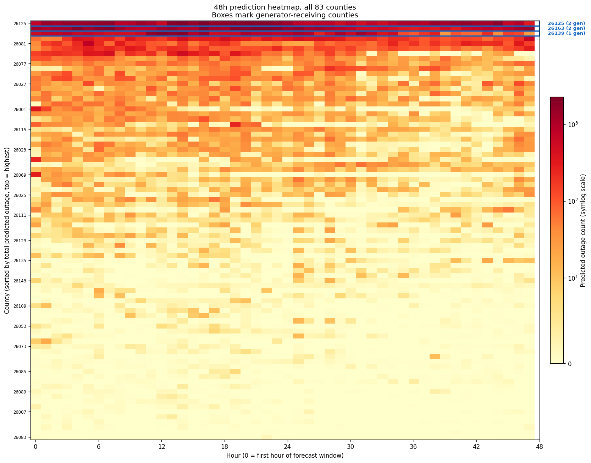
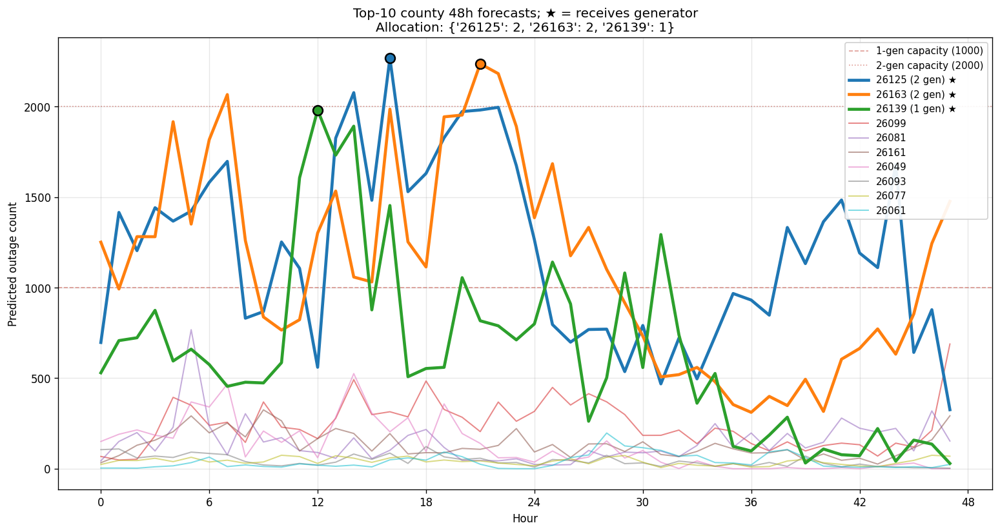
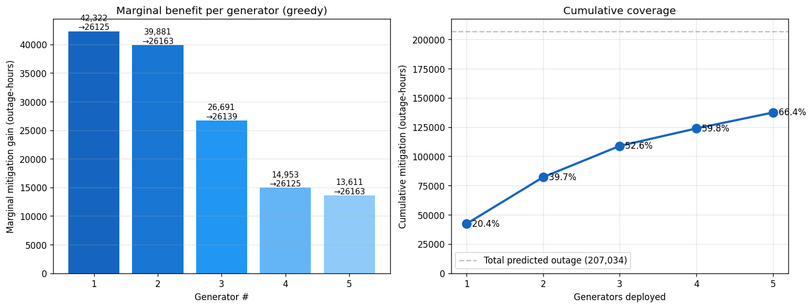
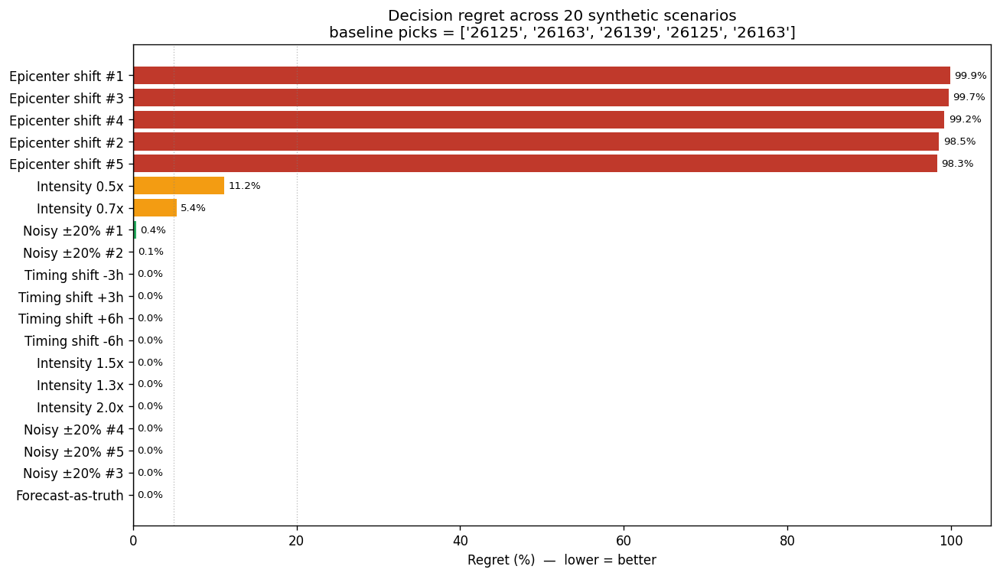
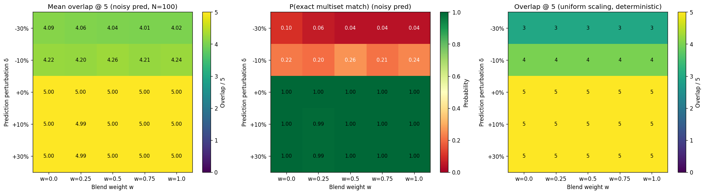

# Power Outage Forecasting & Backup Generator Placement

Forecast hourly power outages across **83 Michigan counties** at 24h/48h horizons, then use those
forecasts to decide where to place **5 backup generators** so the most customer-hours of outage are
mitigated.

<sub>Final project for **CMU 95-828 Machine Learning for Problem Solving**, Spring 2026.</sub>


**Headline:** 24h RMSE **18.8% below** the historical-average baseline; the forecast-driven generator
plan mitigates **28% more** outage-hours than the conventional "place by population" heuristic.

> **中文简介** — 本项目分两部分。第一部分用历史停电与天气数据预测密歇根州 83 个县未来 24/48 小时的每小时停电数；
> 第二部分基于预测结果决定 5 台备用发电机的投放位置，使缓解的停电量最大化。最终 24h RMSE 相比历史均值基线降低
> **18.8%**，发电机分配方案的缓解量比"按人口投放"的常规做法高出 **28%**。

---

## Results

### Part I — Forecasting

Per-county RMSE on raw outage counts, interleaved validation split. Lower is better.

| Model | 24h RMSE | 48h RMSE | vs. Historical Average (24h) |
|---|---:|---:|---:|
| **HistGBM + Tier B features** | **92.17** | **80.81** | **−18.8%** |
| Historical Average *(baseline)* | 113.42 | 102.00 | — |
| Zero (predict no outage) | 116.10 | 100.46 | +2.4% |
| Deep LSTM (best of 9 configs) | 129.71 | 122.80 | +14.4% |
| Persistence | 153.40 | 136.66 | +35.2% |
| Deep LSTM + GNN | 160.35 | 147.13 | +41.4% |

<p align="center">
  
  <br><sub>48h forecast across all 83 counties, sorted by total predicted outage. Boxed rows receive generators.</sub>
</p>

### Part II — Generator placement

Total outage-hours mitigated over the 48h window (207,034 outage-hours predicted in total).

| Strategy | Mitigation | % of total |
|---|---:|---:|
| **Ours (forecast-driven optimization)** | **137,461** | **66.4%** |
| Top-5 counties by population | 107,019 | 51.7% |
| Random uniform (mean of 200 trials) | 11,909 | 5.8% |

Selected allocation: **two generators to FIPS 26125, two to FIPS 26163, one to FIPS 26139.**

<p align="center">
  
</p>

<p align="center">
  
  <br><sub>Marginal benefit falls off sharply after the third generator — the 4th and 5th recover roughly a third of what the 1st does.</sub>
</p>

---

## Data

`train.nc` — 2,161 hours × 83 counties × 109 weather variables, plus hourly outage and
tracked-customer counts.

The dataset is distributed through the course and is **not included in this repository.** Two small
demo files (`data/test_24h_demo.nc`, `data/test_48h_demo.nc`) are provided so the notebooks can be
inspected end to end.

The outage target is severely imbalanced: **70.5% of county-hours are zero**, the distribution is
heavily right-skewed, and the maximum observed value is 23,346. Almost every design decision in this
project follows from that fact.

---

## Approach

### Part I: Forecasting

**Regime discovery.** Rather than hand-picking outage severity thresholds, a Gaussian Mixture Model
(k=5) was fit to the outage distribution, yielding data-driven regime boundaries at **[3, 14, 77, 404]**
separating quiet / minor / routine / moderate / severe conditions. These regimes were used both for
stratified EDA and as model features.

**Feature selection by consensus.** Weather variables were ranked by four independent criteria —
Pearson correlation, Spearman correlation, storm-period discriminative power, and random-forest
importance — and retained only where the methods agreed. Collinear survivors (r > 0.85) were pruned
and sign consistency was checked to drop unstable predictors.

**Feature engineering (193 → ~42 dimensions).** Gradient-boosting importance analysis showed that
112 of 193 engineered features contributed ≤ 0%. The feature set was rebuilt into two tiers:

| Group | Importance | v1 | v2 | Decision |
|---|---:|---:|---:|---|
| Outage lags | 60.4% | 10 | 10 | keep |
| Outage rolling windows | 30.2% | 15 | 15 | keep |
| Weather rolling | 6.3% | 42 | ≤12 | reduce to 24h windows on top-6 weather vars |
| Storm indicators | 3.1% | 3 | 3 | keep |
| Outage regime | 1.0% | 2 | 2 | keep (Tier B only) |
| Raw weather | 0.5% | 88 | 3 | compress via PCA |
| Time encodings | 0.0% | 9 | 4 | keep sin/cos only |
| Weather lags | −0.8% | 18 | 0 | drop |
| Weather interactions | −0.8% | 6 | 0 | drop |

**Tier A** (~28 dims, ~94% of importance) for sequence models; **Tier B** (~42 dims, ~99%) for tree
models and transformers.

**The validation split fix.** The original chronological 80/20 split placed a large late-June storm
entirely in the validation set — train mean 32.7 vs. validation mean 87.9. Every model looked like it
was overfitting. Switching to an interleaved split (every fifth day held out) brought the
distributions into alignment (46.7 vs. 32.9) and dropped log-space validation RMSE from 1.38 to 1.02.
**The apparent overfitting was distribution mismatch, not overfitting.** All baseline numbers were
recomputed after this change.

**Model exploration.** A 3-layer residual LSTM with LayerNorm was extended with a GCN
spatial-propagation branch and gated fusion (241K and 315K parameters). Across four loss
configurations the model either collapsed or exploded:

- **Rate target + Huber (δ=0.01)** — training loss hit zero at epoch 1. With 70% of samples at zero,
  predicting zero everywhere was the global optimum. Predicted peak reached only 12% of the true maximum.
- **Weighted MSE (w=20, threshold 0.005)** — over-corrected into wild over-prediction: RMSE 360.93,
  predicted peak 39,811 against a true maximum of 11,903.
- **Weighted MSE (w=3, threshold 0.01)** — landed in between at 129.71, still worse than the
  historical-average baseline.

Across all three, rate-space validation RMSE converged to **0.0099 ± 0.002** — a ceiling imposed by
the feature set and architecture, not by the loss. Changing the loss only moved where that ceiling
landed in raw space.

`HistGradientBoostingRegressor` on the identical features and split reached **92.17 in four seconds
of training**, beating the LSTM by roughly 50 RMSE points. The signal was in the features; the
recurrent architecture was losing it — most likely because a 48-hour input window collapsed into a
single hidden state dilutes the dominant 1–6 hour lag signal, and because RNNs respond slowly to the
sharp onsets that define storms.

**The large-metro effect.** A single county (FIPS 26125) alone accounts for 15–20% of the county-averaged
RMSE. The four largest counties dominate the metric; the remaining 79 average only 40–50 RMSE. Any
further gain has to come from treating large metros separately.

### Part II: Generator placement

Placement was formulated as an allocation problem over the 48-hour forecast, maximizing total
mitigated outage-hours subject to per-generator capacity, with generators allowed to double up on a
single county.

Because the decision depends on a forecast, the solution was stress-tested rather than reported as a
point answer:

| Perturbation | Regret | Reading |
|---|---|---|
| Forecast noise ±20% (5 draws) | 0 – 0.41% | insensitive to error of this magnitude |
| Timing shifts ±3h, ±6h | 0% in all 4 cases | onset timing does not matter |
| Storm intensity 1.3× – 2.0× | 0% | robust when storms are as bad as or worse than forecast |
| Storm intensity 0.5× / 0.7× | 11.2% / 5.4% | degrades gracefully when milder |
| **Epicenter relocation (5 draws)** | **98 – 99.9%** | **the honest failure mode** |

<p align="center">
  
</p>

**Location accuracy, not intensity accuracy, is what the plan depends on.** If the storm hits a
different part of the state than forecast, a placement optimized for the forecast epicenter is worth
almost nothing. That is worth stating plainly rather than burying: the robustness result is only
half good news.

Under a blend-weight sweep the selected counties are stable across the full weight range. Under a
uniform perturbation of the forecast, one of five picks changes at −10% and two of five change at
−30%; positive shifts leave the plan unchanged.

<p align="center">
  
</p>

Selection frequency across all sensitivity runs:

| FIPS | Frequency | In baseline plan |
|---|---:|---|
| 26125 | 187.5% *(frequently allocated two)* | ✅ |
| 26163 | 177.8% | ✅ |
| 26139 | 100.0% | ✅ |
| 26099 | 34.4% | — |
| 26081 | 0.2% | — |

---

## Repository structure

```
phase1_eda.ipynb                    EDA, GMM regimes, feature selection, feature engineering v2, baselines
model_deep_lstm.ipynb               Deep LSTM + GNN, loss ablations, HistGBM diagnostic
model_template.ipynb                Shared training scaffold used by the team (config / data / eval)
comparison_model.ipynb              Cross-model comparison
sensitivity_analysis_update.ipynb   Part II robustness and regret analysis
demo.ipynb                          SARIMAX + Seq2Seq baselines, first Part II allocation
Notebooks/
  model_deep_lstm_Colab.ipynb       Colab runner, incl. direct multi-horizon ensemble
docs/
  part2_analysis.ipynb              Generator placement optimization
  PROGRESS.md                       Full experiment log — every failed configuration and why
scripts/
  verify_submission.py              Submission format validation
  README_ENSEMBLE.md                How to reproduce the ensemble deliverables
results/                            Checkpoints, predictions, figures, sensitivity outputs
```

`docs/PROGRESS.md` is the most informative file in this repository. It records the whole search,
including the three days spent proving that no loss function would rescue the LSTM.

## Reproducing

```bash
git clone https://github.com/wangruig-lang/MLPS_Final_Project.git
cd MLPS_Final_Project
pip install -r requirements.txt
```

Place `train.nc` in `data/`, then run `phase1_eda.ipynb` followed by `model_deep_lstm.ipynb`. On
Colab, select a T4 GPU runtime. Weights & Biases logging is optional — copy `.env.example` to `.env`
to enable it.

## My contribution

Team project. I was responsible for **most of the model construction**, the **Phase 1 data analysis**
(EDA, regime discovery, feature selection and engineering), and the **tuning of the Phase 2 deep
learning models** — the LSTM/GNN loss ablations and the HistGBM diagnostic that redirected the team.

## What I would do differently

**Run the tabular baseline first.** Gradient boosting took four seconds and would have revealed the
architecture bottleneck immediately; instead it came after three days of loss-function tuning.
Establishing a strong tabular baseline before reaching for a sequence model is now the first thing I
do on any structured forecasting problem.
